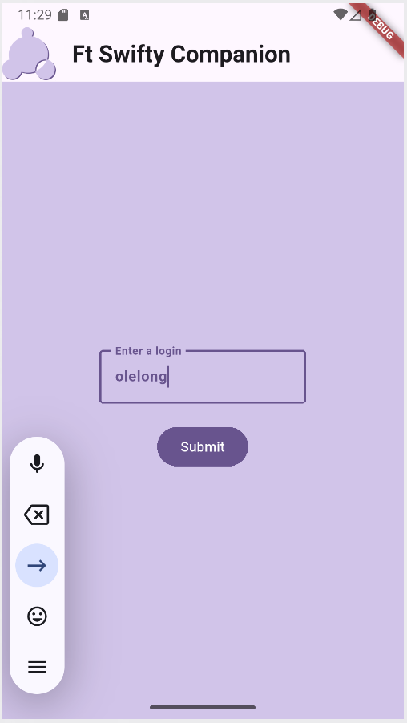
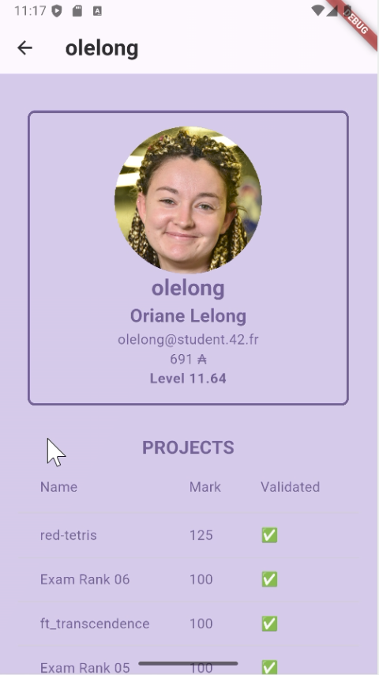
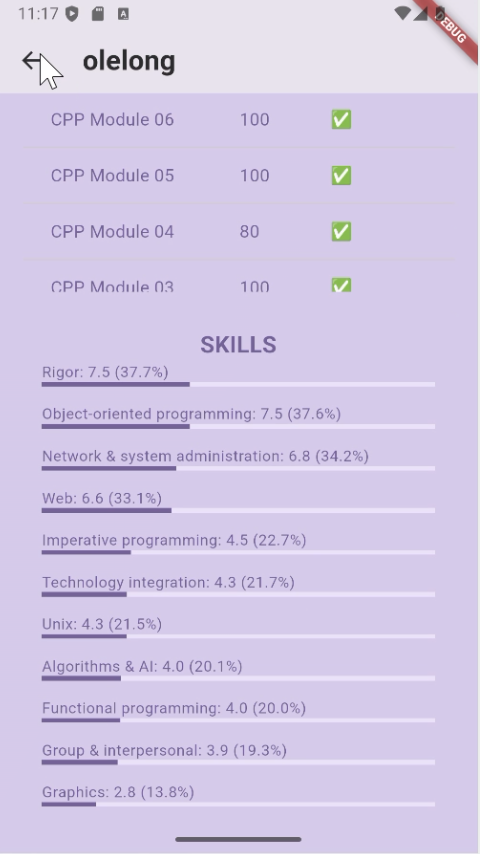

<h1>
   Ft Swifty Companion
</h1>

A solo project. This project is a mobile application that consumes the 42 API to retrieve and display student profile information. The goal is to build a clean, responsive app with at least two views:
  - First view (search): the user enters a login and submits a search.
  - Second view (profile): if the login exists, the app displays the student's information. A navigation option allows the user to go back to the search view.

---
<h2> Details </h2>

**Example of the First view (search):**
<div align="left">
 
</div>


**The profile view shows:**
- the user's profile picture and at least four personal details (e.g. login, email, mobile, level, location, wallet, evaluations);
- the user's skills, with their level and percentage;
- the projects the user has taken part in, including failed ones.
Examples:
<div align="left">
  <tr>
    <td>
      
    </td>
    <td>
      
    </td>
  </tr>
</div>

Other requirements:
- **Error handling:** The app must gracefully handle every failure case, such as an unknown login or a network error, and give the user clear feedback.
- **UI:** The interface must rely on a flexible, modern layout technique so that it renders correctly across different screen sizes and mobile platforms.
- **API usage:** The app must not generate a new authentication token for each request. The token should be obtained once and reused (and renewed only when needed).

**Mise en situation test:**
<table align="center">
  <tr>
    <td>
      <video src="https://github.com/user-attachments/assets/2ed4865e-358a-47cc-8121-8ef353a000cf" controls> Your browser does not support videos but you can watch the demo part 1 <a href="https://github.com/user-attachments/assets/2ed4865e-358a-47cc-8121-8ef353a000cf" >here</a>
      </video>
    </td>
    <td>
      <video src="https://github.com/user-attachments/assets/3134a972-1e88-47ce-9f50-047ff1204c69" controls>
        Your browser does not support videos but you can watch the demo part 2 <a href="https://github.com/user-attachments/assets/3134a972-1e88-47ce-9f50-047ff1204c69" >here</a>
      </video>
    </td>
  </tr>
</table>

---
<h2> Prerequisites </h2>


---
<h2> Setup Instructions </h2>

### Step 1: Clone and Set Up the repository
1. Clone this repository:
    ```bash
   git clone git@github.com:olelong/red-tetris-frontend.git
   cd red-tetris-frontend
   ```
2. Install dependencies:
   ```bash
   npm install
   ```
3. Start the frontend server:
   ```bash
   npm run start
   Y // Would you like to run the app on another port instead? › (Y/n)
   ```

The app will be accessible at:
- **http://localhost:3001** (when run standalone)

---
<h2> Technologies Used </h2>

## Technologies Used
 Framework Flutter to create an app usable on every platform, and Android studio for emulation.
<div align="left">
  
  
</div>

---
<h2> License </h2>

This project is licensed under the MIT License - see the license file for details.

---

Enjoy the App!
